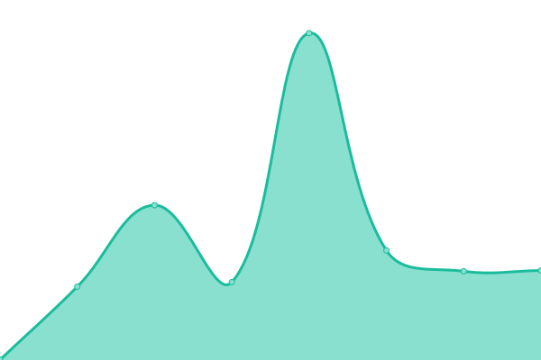

# [📈 Live Status](https://status.tinvn.eu.org): <!--live status--> **🟧 Partial outage**

This repository contains the open-source uptime monitor and status page for [HN TinVN](tinvn.eu.org), powered by [Upptime](https://github.com/upptime/upptime).

With [Upptime](https://upptime.js.org), you can get your own unlimited and free uptime monitor and status page, powered entirely by a GitHub repository. We use [Issues](https://github.com/hnguyen1910/status/issues) as incident reports, [Actions](https://github.com/hnguyen1910/status/actions) as uptime monitors, and [Pages](https://status.tinvn.eu.org) for the status page.

<!--start: status pages-->
<!-- This summary is generated by Upptime (https://github.com/upptime/upptime) -->
<!-- Do not edit this manually, your changes will be overwritten -->
<!-- prettier-ignore -->
| URL | Status | History | Response Time | Uptime |
| --- | ------ | ------- | ------------- | ------ |
|  [Homepage](https://tinvn.eu.org) | 🟩 Up | [homepage.yml](https://github.com/hnguyen1910/status/commits/HEAD/history/homepage.yml) | 

 3078ms
     
 | 

<a href="https://status.tinvn.eu.org/history/homepage">39.73%</a>
    

|  [Link Shortener (basic)](https://r.tinvn.eu.org) | 🟩 Up | [link-shortener-basic.yml](https://github.com/hnguyen1910/status/commits/HEAD/history/link-shortener-basic.yml) | 

 2104ms
     
 | 

<a href="https://status.tinvn.eu.org/history/link-shortener-basic">70.66%</a>
    

|  [Link Shortener (discord.gg links)](https://d.tinvn.eu.org) | 🟩 Up | [link-shortener-discord-gg-links.yml](https://github.com/hnguyen1910/status/commits/HEAD/history/link-shortener-discord-gg-links.yml) | 

 2032ms
     
 | 

<a href="https://status.tinvn.eu.org/history/link-shortener-discord-gg-links">74.49%</a>
    

|  [Files](https://fs.tinvn.eu.org) | 🟩 Up | [files.yml](https://github.com/hnguyen1910/status/commits/HEAD/history/files.yml) | 

 884ms
     
 | 

<a href="https://status.tinvn.eu.org/history/files">70.40%</a>
    

|  [NoPaste](https://nopaste.tinvn.eu.org) | 🟩 Up | [no-paste.yml](https://github.com/hnguyen1910/status/commits/HEAD/history/no-paste.yml) | 

 171ms
     
 | 

<a href="https://status.tinvn.eu.org/history/no-paste">100.00%</a>
    

|  [NPaste](https://paste.tinvn.eu.org) | 🟥 Down | [n-paste.yml](https://github.com/hnguyen1910/status/commits/HEAD/history/n-paste.yml) | 

 4835ms
     
 | 

<a href="https://status.tinvn.eu.org/history/n-paste">58.76%</a>
    

|  [This status page](https://status.tinvn.eu.org) | 🟩 Up | [this-status-page.yml](https://github.com/hnguyen1910/status/commits/HEAD/history/this-status-page.yml) | 

 183ms
     
 | 

<a href="https://status.tinvn.eu.org/history/this-status-page">100.00%</a>
    

<!--end: status pages-->

[**Visit our status website →**](https://status.tinvn.eu.org)

## 📄 License

- Powered by: [Upptime](https://github.com/upptime/upptime)
- Code: [MIT](./LICENSE) © [HN TinVN](tinvn.eu.org)
- Data in the `./history` directory: [Open Database License](https://opendatacommons.org/licenses/odbl/1-0/)
